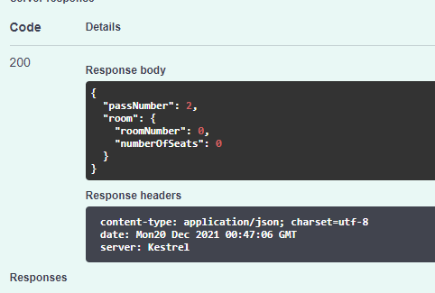

# Разработка информационной системы для контрольно-пропускной системы общежития

## Содержание

[Введение](#introdution)

[1 Описание предметной области](#domainDescription)

[2 Сравнительный анализ существующих программных решений](#existSoftware)

[3 Разработка](#Development)

[4 Проектирование системы](#Systemdesign)

[5 Тестирование системы](#Checkingandtestingthesystem)

[Заключение](#Conclusion)

[Список литературы](#Listofliterature)

<a name="introdution"/>

# Введение

## *Общее описание*

Ещё с древности у людей существовала потребность в отличии своих от чужих. Постепенно, вместе с развитием человечества,
у нас стали появляться разлиные решения для данной потребности. В нашем случае рассматривается задача контроля входа и
выхода в студенческое общежитие. Схожие пропускные системы существуют уже давно и успели себя зарекомендовать. Например,
в таких видах организаций, как : Военные, Образовательные, Частные.

Из данных областей нашей более близка система, используемая в образовательных или частных организациях.

<a name="domainDescription"/>

# 1 Описание предметной области

Общежи́тие — место временного проживания для приезжих студентов и учащихся на время учёбы, сезонных рабочих на время
работы, службы или ставшее постоянным для работников учреждения. Соответственно, следует различать студенческие и
рабочие общежития.

Контрольно-пропускной пункт — в военном деле, а также в гражданской сфере обеспечения безопасности имеет два значения:
специально оборудованное место на объекте для осуществления контроля в установленном порядке за проходом людей и
проездом транспортных средств на территорию объекта.

Контрольно-пропускной режим - это комплекс организационно-правовых ограничений и правил, устанавливающих порядок
пропуска через контрольно-пропускные пункты в отдельные здания (помещения) сотрудников объекта, посетителей, транспорта
и материальных средств. Контрольно-пропускной режим является одним из ключевых моментов в организации системы
безопасности на предприятии. С этих позиций контрольно-пропускной режим представляет собой комплекс организационных
мероприятий (административно-ограничительных), инженерно-технических решений и действий службы безопасности.

В данной системе участвует 3 лица: посетитель, вахтёр, комендант.

Посетитель - это тот, кто взаимодействет с КПП, обеспечивающем *"отсеивание"* своих от чужих. Вахтёр - важное лицо,
взаимодействующее с пропусками. Комендант - заселяет посетителей и выписывает пропуски. Все вместе, они образуют
информационную систему.

Задача:

-создание информационного сайта обеспечивающего возможность входа и выхода из общежития, регистрацию в нём и выдачу
пропусков;

Проблема :

-быстрый, регестрируемый вход и выход из общежития;

<a name="existSoftware"/>

# 2 Сравнительный анализ существующих программных решений

Во многих образовательных организациях, в том числе и в ВУЗе, которому принадлежит наше общежитие, установлена и
работает схожая система. Схожесть в участвующих лицах и их обязаннастях.

Планируется схожая контрольно пропускная система ввиде пункта, находящегося в общежитии. Отличие данного решения от
других заключается в в уникальности системы взаимодействия сущностей, в краткости и четкости, бесперебойной работе.

Организация контрольно-пропускного режима отличается определенной сложностью. Дело в том, что механизм осуществления
контрольно-пропускного режима основывается на применении "запретов" и "ограничений" в отношении субъектов, пересекающих
границы охраняемых объектов, для обеспечения интересов предприятия. Такой механизм должен быть безупречным с точки
зрения соответствия требованиям действующего законодательства.

Первая система - СКУД RusGuard.

Аппаратная инфраструктура СКУД КПП не может функционировать без специального программного обеспечения (ПО). Компания
RusGuard предлагает собственный программный комплекс, которые идеально подойдет для обслуживания сетевых СКУД, в том
числе, СКУД КПП. Наше ПО представляет собой модульное решение, способное управлять всеми типами устройств СКУД, в том
числе теми, которыми обычно комплектуются СКУД КПП.ПО RusGuard поддерживает работу с охранными устройствами, а также
некоторым другим интегрированным в систему оборудованием, что позволяет «делегировать» сетевой СКУД новые задачи уровня
предприятия.

Вторая система - BIO5.

В контрольно-пропускном зале устраиваются проходы, которые оборудуются техническими средствами охраны и физическими
барьерами. В комплект оборудования, как правило, входят:
средства механизации, автоматизации системы контроля доступа; физические барьеры (ограждения, турникеты, калитки);
основное и резервное освещение; средства связи и тревожной сигнализации; системы видеоконтроля. В качестве средств
контроля доступа могут использоваться различные турникеты. Турникеты предназначены для управления потоками людей и
регулирования входа (выхода). В последнее время наиболее широкое распространение получили электромеханические турникеты.
Электромеханические турникеты, в отличие от громоздких и неудобных в управлении механических, легко управляются с пульта
охранника и могут работать в составе автоматизированной системы контроля доступа.

Ни одна из представленных систем КПП не дподходит для нашей предметой области, поэтому, разработаем её самостоятельно.

<a name="Development"/>

# 3 Разработка

Начинается разработка с рисования use case диаграммы, на которой будут находится основные действующие лица (см. Рисунок
1).

<p align="center">
</p>
<p align="center"> Рисунок 1 - USE CASE диаграмма</p>

Затем, используя эти наброски, нарисуем DFD диаграмму для лучшего представления движения данных в нашей области. Для
наглядности, все действующие лица выделены своими цветами. Посетитель(красный) Вахтёр(синий) Комендант(желтый) (см.
Рисунок 2)

<p align="center">
</p>
<p align="center"> Рисунок 2 - Data Flow диаграмма</p>

Следующий шаг - создание ER диаграммы для всех сущностей (см. Рисунок 3).

<p align="center">
</p>
<p align="center"> Рисунок 3 - ER диаграмма</p>

На основе этой диаграммы мы создаем классы в среде C# и описываем их с параметрами и их типами данных. Для этого мы
создаем его, определяем в простраство имен и описываем класс (см. Рисунок 4)
<p align="center">
</p>
<p align="center"> Рисунок 4 - класс</p>

Создаем такие классы для всех сущностей из ER - диаграммы (см. Рисунок 5)
<p align="center">
</p>
<p align="center"> Рисунок 5 - список классов</p>

Реализация системы начинается с ER-диаграммы создаются классы. Пример класса "Посетитель общежития"(см. Листинг 1).

Листинг 1 - Класс "Посетитель общежития".
```csharp
namespace Zamay.Domain
{
    public class Visitor
    {
        public int VisitorNumber { get; set; }
        public Document Documents { get; set; }
        public bool check { get; set; }
    }
}
```

Пример класса "Время входа"(см. Листинг 2).

Листинг 2 - Класс "Время входа".
```csharp
using System;

namespace Zamay.Domain
{
    public class ArrivalTime
    {
        public int ArrivalTimeNumber { get; set; }
        public DateTime EnterTime { get; set; }
        public Pass Pass { get; set; }
    }
}
```

***

Так же для работы приложения были разработаны и созданы хранилища, позволяющие хранить, актуализировать и использовать
информацию (см. Рисунок 6)

<p align="center">
</p>
<p align="center"> Рисунок 6 - список хранилищ</p>

Пример кода хранилища посетителей (см. Листинг 3)

Листинг 3 - Класс "Хранилище посетителей".
```csharp
using System.Collections.Generic;
using Zamay.Domain;

namespace Zamay.Repository
{
    public class VisitorStorage
    {
        private Dictionary<int, Visitor> visitors { get; } = new();

        public void Create(Visitor visitor)
        {
            visitors.Add(visitor.VisitorNumber, visitor);
        }

        public Visitor Read(int visitorNumber)
        {
            return visitors[visitorNumber];
        }

        public Visitor Update(int visitorNumber, Visitor newVisitor)
        {
            visitors[visitorNumber] = newVisitor;
            return visitors[visitorNumber];
        }

        public bool Delete(int visitorNumber)
        {
            return visitors.Remove(visitorNumber);
        }

        public bool Check(int visitorNumber)
        {
            if (visitors[visitorNumber] != null)
                return true;
            return false;
        }
    }
}
```

Пример кода хранилища входов (см. Листинг 4)

Листинг 4 - Класс "Хранилище входов".

```csharp
using System.Collections.Generic;

namespace Zamay.Domain
{
    public class ArrivalTimeStorage
    {
        private Dictionary<int, ArrivalTime> ArrivalTimes { get; } = new();

        public void Create(ArrivalTime arrivalTime)
        {
            ArrivalTimes.Add(arrivalTime.ArrivalTimeNumber, arrivalTime);
        }

        public ArrivalTime Read(int arrivalTimeNumber)
        {
            return ArrivalTimes[arrivalTimeNumber];
        }

        public ArrivalTime Update(int arrivalTimeNumber, ArrivalTime newArrivalTime)
        {
            ArrivalTimes[arrivalTimeNumber] = newArrivalTime;
            return ArrivalTimes[arrivalTimeNumber];
        }

        public bool Delete(int arrivalTimeNumber)
        {
            return ArrivalTimes.Remove(arrivalTimeNumber);
        }
    }
}
```

***

Затем созадём контроллеры, которые будут взаимодействовать с ранее созданными классами (см. Рисунок 7)

<p align="center">
</p>
<p align="center"> Рисунок 7 - список контроллеров</p>

Разработали набор web-методов, включая 4 базисные опрации CRUD, для каждой из сущностей, отображающие предметную область(см. Листинг 5).

Листинг 5 - Контроллер класа "Посетитель".
```csharp
using Microsoft.AspNetCore.Mvc;
using Zamay.Domain;
using Zamay.Repository;

namespace Zamay.Controllers
{
    [ApiController]
    [Route("/visitor")]
    public class VisitorController : ControllerBase
    {
        [HttpPut("Register")]
        public Visitor Create(Visitor visitor)
        {
            Storage.VisitorStorage.Create(visitor);
            return visitor; // Метод для регистрации в общежитии
        }
    }
}
```

Пример кода контроллера вахтера (см. Листинг 6)

Листинг 6 - Контроллер класа "Вахтер".
```csharp
using Microsoft.AspNetCore.Mvc;
using Zamay.Domain;
using Zamay.Repository;
using static System.DateTime;

namespace Zamay.Controllers
{
    [ApiController]
    [Route("/watchman")]
    public class Vahter : ControllerBase
    {
        [HttpPatch("RestorePass")]
        public Pass RestorePass(int PassNumber, Pass newPass)
        {
            return Storage.PassStorage.Update(PassNumber, newPass);
        }

        [HttpPut("LeavingTimeRegister")]
        public string Create(LeavingTime leavingTime, int visitorNumber)
        {
            if (!Storage.VisitorStorage.Check(visitorNumber)) return "Scam";
            leavingTime.LeaveTime = Now;
            Storage.LeavingTimeStorage.Create(leavingTime);
            return leavingTime + " " + "Добавлено!";
        }

        [HttpPut("ArrivalTimeRegister")]
        public string Create(ArrivalTime arrivalTime, int visitorNumber)
        {
            if (!Storage.VisitorStorage.Check(visitorNumber)) return "Scam";
            arrivalTime.EnterTime = Now;
            Storage.ArrivalTimeStorage.Create(arrivalTime);
            return arrivalTime + " " + "Добавлено!";
        }
        
        [HttpGet("GetInfoAboutVisitor")]
        public Visitor Read(int visitorNumber)
        {
            return Storage.VisitorStorage.Read(visitorNumber);
        }

        [HttpDelete("DeleteVisitor")]
        public bool Delete(int visitorNumber)
        {
            return Storage.VisitorStorage.Delete(visitorNumber);
        }
    }
}
```

<a name="Checkingandtestingthesystem"/>

## Тестирование системы

При запуске приложения открывается вкладка браузера Swagger UI, в котором представлены котроллеры и их операции над
сущностями (см. Рисунок 8)
<p align="center">
</p>
<p align="center"> Рисунок 8 - Swagger UI</p>

Проверка работы методов CRUD (Create - создание, Read - чтение, Update - обновление, Delete - удаление) в контроллере
Watchman (см. Рисунок 9)

<p align="center">
</p>
<p align="center"> Рисунок 9 - Проверка работы методов CRUD</p>

1. Метод Create позволяет добавлять новую запись в хранилище (см. Рисунок 10)

<p align="center">
</p>
<p align="center"> Рисунок 10 - Проверка работы метода Create</p>


После ввода данных, сервер нам отвечает(см. Рисунок 11)
<p align="center">
</p>
<p align="center"> Рисунок 11 - Ответ сервера</p>

2. Метод Read позволяет нам считать запись из хранилища (см. Рисунок 12).

<p align="center">
</p>
<p align="center"> Рисунок 12 - Проверка работы метода Read</p>

<p align="center">
</p>
<p align="center"> Рисунок 13 - Ответ сервера</p>

3. Функция Update, служащая для редактирования записей в хранилище по идентификатору. В окно PassNumber мы вводим номер
   пропуска, у которого мы желаем изменить данные, а в Request body новые данные (см. Рисунок 14) .

<p align="center">
</p>
<p align="center"> Рисунок 14 - Проверка метода Update </p>

<p align="center">
</p>
<p align="center"> Рисунок 15 - Ответ сервера </p>

4. Метод Delete, служащий для удаления записей по идентификатору (см. Рисунок 16) .

<p align="center">
</p>
<p align="center"> Рисунок 16 - Проверка метода Delete </p>

<p align="center">
</p>
<p align="center"> Рисунок 17 - Ответ сервера </p>

***
<a name="Conclusion"/>

## Заключение

В результате реализации проекта "Контрольно пропускной пункт общежития", решены следующие задачи: регистрация
посетителей общежития, выдача пропусков и их проверка, также хранение информации о входах-выходах из общежития. Также
были получены новые навыки по созданию веб-сайта и основных операций CRUD. Данная информационная система выполняет
функции создания, чтения, редактирования и удаления записей. Это система актуальна и перспективна для дальнейшей
разработки.

<a name="Listofliterature"/>

## Список используемой литературы

[1] https://ntagil.org/bezopas/info.php?SECTION_ID=1216

[2] http://bio5.ru/articles/kontrol-dostupa/kontrolno-propusknoi-rezhim-na-predpriyatii.html

[3] https://www.rgsec.ru/lip/skud-kpp.html

[4] https://www.lucidchart.com/pages/ru/erd-диаграмма

[5] https://habr.com/ru/company/trinion/blog/340064/